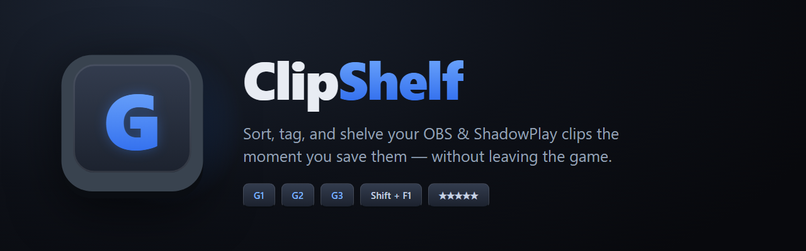
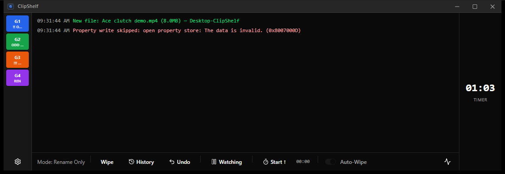
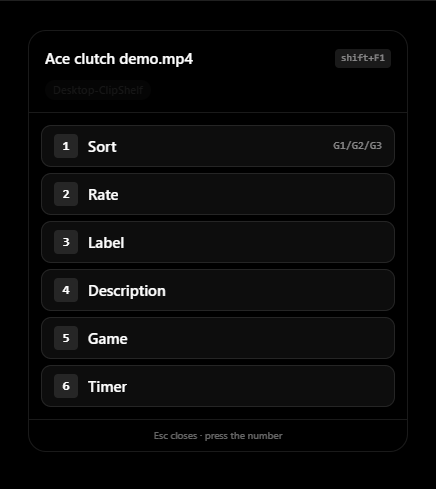

<p align="center">
  
</p>

<h1 align="center">ClipShelf</h1>

<p align="center">
  <b>Sort, tag, and shelve your OBS / ShadowPlay clips the moment you save them — without leaving the game.</b><br/>
  Windows desktop app built with Tauri v2 (Rust backend, React frontend).<br/><br/>
  <a href="https://github.com/Bristopher/ClipShelf/releases/latest"><b>⬇ Download the latest release</b></a>
</p>

---

## The problem

You save a clutch clip mid-game. Three hours later you have 40 files named
`2026-07-16 15-24-09.mp4` and no idea which one was the ace, which were
funny fails, and which are black-screen duds. Sorting them after the
session never happens.

ClipShelf fixes this at the only moment it can be fixed: **the second the
clip is saved**, while you still remember what just happened.

## What it does

### 🎹 G-key sorting — file clips while you play
Bind three folders (e.g. `!!`, `odd`, `!!!`) and press **G1 / G2 / G3** the
moment a clip lands — the file moves instantly. **G4** renames the newest
clip. A configurable countdown timer reminds you the clip is still
unsorted, drag-and-drop from Explorer works too, and every action is
undoable with Ctrl+Z. Binds default to `Ctrl+F13–F15` — map your keyboard's
G-keys (iCUE / G HUB / macro pad) to those, same trick as the original
GKey-Mover script.

### 🎮 Game detection — every clip knows where it came from
When a clip saves, ClipShelf detects the fullscreen or borderless game you
were playing (falling back to `Desktop-<app>` for desktop captures) and
writes it into the file's **Windows properties** — visible as Tags right in
Explorer. Wrong guess? Fix it once with *Save &amp; Remember* and that exe
is corrected forever.

### 🕹️ In-game overlay — tag clips without alt-tabbing
Press **Shift+F1** (rebindable) over your game: a CS:GO-buy-menu-style
panel appears **without stealing focus** — the game keeps running and
receiving input, and exclusive-fullscreen games don't minimize. Number keys
drive everything:

| Key | Action |
|-----|--------|
| 1 | Sort the clip to a G-key folder (binds shown on the buttons) |
| 2 | Star-rate 1–5 — real Explorer ★ ratings |
| 3 / 4 | Label / describe via preset chips or free typing (keystrokes never reach the game) |
| 5 | Fix the detected game (+ remember) |
| 6 | Stopwatch |

Labels rename the file (`clip - clutch.mp4`), ratings and descriptions go
into file properties, and everything lands in the history.

### 📚 Clip history — your session, shelved
The History view groups today's clips by game with true clip counts, full
history by day, right-click actions (reveal, play, copy path), and
one-click game fixes. "Today" rolls over at a configurable hour (default
4 AM) so a 2 AM session stays with yesterday's gaming.

### 🔴 Recording-aware
A continuous OBS recording is not a clip. ClipShelf notices the file is
still being written, stays out of the way ("Recording in progress…"), and
the moment you stop recording it becomes a normal, sortable clip — tagged
with the game you were playing when recording **started**.

### 🖱️ Hold-to-click-through
Keep the semi-transparent window floating over your game/browser. Hold
**Ctrl** (configurable) and clicks pass straight through it to whatever is
underneath — no minimizing, no focus juggling.

### And the rest
- **Themes** — dark / light / pink / match-Windows / fully custom, applied
  everywhere including the custom tray menu
- **OBS WebSocket** integration for instant, exact clip notifications
- **Sounds** for save / move / error (customizable), black-screen small-file
  warnings, watcher health checks with auto-recovery
- **In-app updates** — checks GitHub on launch, always asks first, delta
  downloads via Velopack; can be disabled in Settings
- **Tray-first** — closes to tray, themed tray menu, autostart option

## Screenshots

**Main window** — a clip just landed, game detected, sort timer running:



**In-game overlay** (`Shift+F1`) — tag the clip without leaving your game:

<p align="center">
  
</p>

## Install

Grab the latest from **[Releases](https://github.com/Bristopher/ClipShelf/releases/latest)**:

| File | What it is |
|------|-----------|
| `ClipShelf_x.y.z_x64-setup.exe` | Installer — recommended; enables in-place delta updates |
| `ClipShelf_x.y.z_x64-Portable.exe` | Single portable exe — update checks open this page instead |

First run walks you through picking your clips folder and binds.

## Reading clip metadata from other apps

Everything ClipShelf writes is a documented, stable contract — filename
label suffix, Windows property IDs (Tags / Rating / Comments), and an
append-only `history.jsonl`. See
[`Docs/Features/Clip-Metadata-Interop.md`](Docs/Features/Clip-Metadata-Interop.md)
for the schema plus PowerShell / Python / C# / Node reader snippets.

## Develop

```
pnpm install
pnpm tauri dev           # hot-reload frontend, rebuilds Rust
cd src-tauri && cargo test
```

Architecture and feature docs live in `Docs/` (see `CLAUDE.md` for the
map). Releases are published with `.\build-release.ps1` — see
[RELEASING.md](RELEASING.md).

## Heritage

ClipShelf is the third life of this idea:
[GKey-Mover](https://github.com/Bristopher/GKey-Mover) (the original
Python script + options.txt) → GKey Mover v2 (this codebase's first name)
→ **ClipShelf**. Issues, questions, and feature requests all welcome
[here](https://github.com/Bristopher/ClipShelf/issues).
